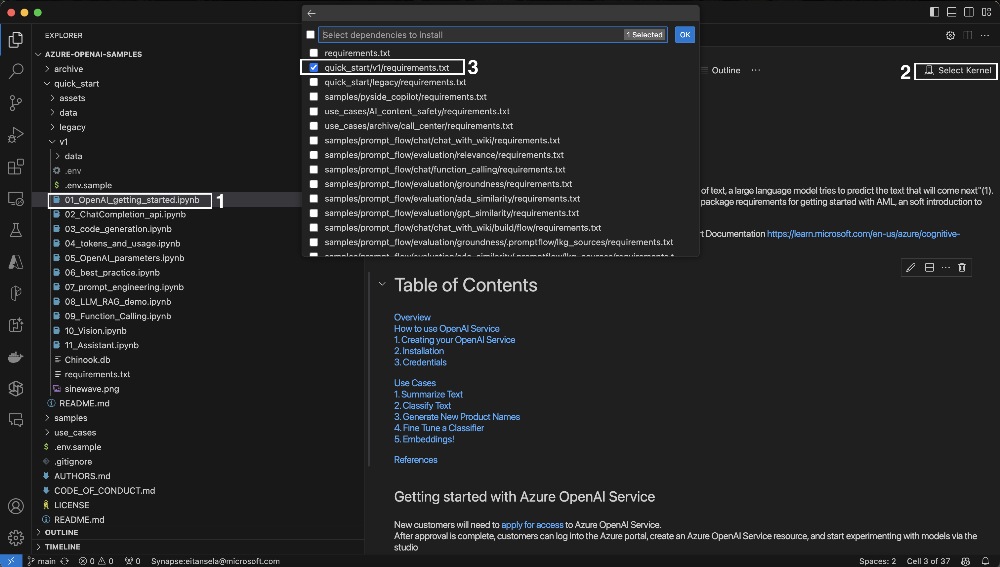

# Quickstart - Running Demos

## Demos Overview

| Name                           | Goal & Description                                                                                     | Use Cases & Topics                                                                                           |
|--------------------------------|--------------------------------------------------------------------------------------------------------|------------------------------------------------------------------------------------------------------|
| [01_OpenAI_getting_started](v1/01_OpenAI_getting_started.ipynb) | This "quick start" notebook introduces users to high-level LLM concepts like: "Summarize Text", "Classify Text", "Generate new product names", and "Embeddings". | Very good sample for beginners and to showcase in some simple examples what Azure OpenAI can do.|
| [02_Chat_Completion](v1/02_ChatCompletion_api.ipynb)        | Shows chat completion examples using Chat Completion, Analyzes Customer Feedback and Extracting PII. | Data Privacy, Information Security, Customer Data Management                               |
| [03_Code_Generation](v1/03_Code_Generation.ipynb)        | Shows how to generate code for SQL table statements. Furthermore, shows how AI can explain what code does. | Automated Query Generation, Code Assistance, Educational Tools for Developers, Code Documentation, Automated Code Review |
| [04_Tokens_And_Usage](v1/04_tokens_and_usage.ipynb)       | Demonstrates the token system. How to tokenize a prompt and get information about words.| Cost Management, Performance Optimization, Quota Management, Optimize Prompts |
| [05_OpenAI_Parameters](v1/05_OpenAI_parameters.ipynb)      | Shows what type of parameters there are and how they affect the result.| Compare Responses, Increase Diversity, Enhance Robustness, Best Practices|
| [06_Best_Practice](v1/06_best_practice.ipynb)          | Shows overall best practices. | Best Practices overall for prompt engineering with OpenAI API. |
| [07_Prompt_Engineering](v1/07_prompt_engineering.ipynb)     | Shows further best practices for optimizing prompting. | Best Practices overall for prompt engineering |
| [08_LLM_RAG](v1/08_LLM_RAG_demo.ipynb)           | Demonstrates how to do RAG using Bing Search results as provided context. | Knowledge Management, Business intelligence & analytics, Legal and compliance |
| [09_Function_Calling](v1/09_Function_Calling.ipynb)       | Shows how to integrate a custom function and have OpenAI call it to retrieve weather information. | Dynamic Calculations, Data fetching, Interactive Applications, Custom integrations  |
| [10_GPT-4V](v1/10_GPT-4V.ipynb)                 | Great to show what can be done with image analysis. Generates text description for provided image. | Content Creation, Accessibility, Image Classification, E-commerce |
| [11_Assistant](v1/11_Assistant.ipynb)                 | Create AI assistant for Data Visualization using advanced tools like code interpreter. | Personalized Customer Service, Employee Onboarding and Training, Sales and Marketing Support |

## Prepare Environment
- [ ] Install [Python](https://www.python.org/downloads/)
- [ ] Install [Visual Studio Code](https://code.visualstudio.com/download)
- [ ] Install [VSC - Python Extension](https://marketplace.visualstudio.com/items?itemName=ms-python.python)
- [ ] Install [Jupyter Notebook for python](https://python.land/data-science/jupyter-notebook)
- [ ] Install necessary packages: `pip install -r requirements.txt` or Install it via the Visual Studio Code UI

If prompted with a message to install `ipykernel` choose **install**

## Setup Environmental Variables in `.env'`
After creating an Azure OpenAI service, setup the following environmental variables for 
- `AZURE_OPENAI_ENDPOINT`
- `AZURE_OPENAI_KEY`
- `AZURE_OPENAI_DEPLOYMENT_NAME`
- `EMBEDDING_MODEL_NAME` _(Required for 01_OpenAI_getting-started)_
- `BING_SUBSCRIPTION_KEY` _(Required for 08_LLM_RAG_demo)_
---
Feel free to use and copy `.env.sample` and rename to `.env`.