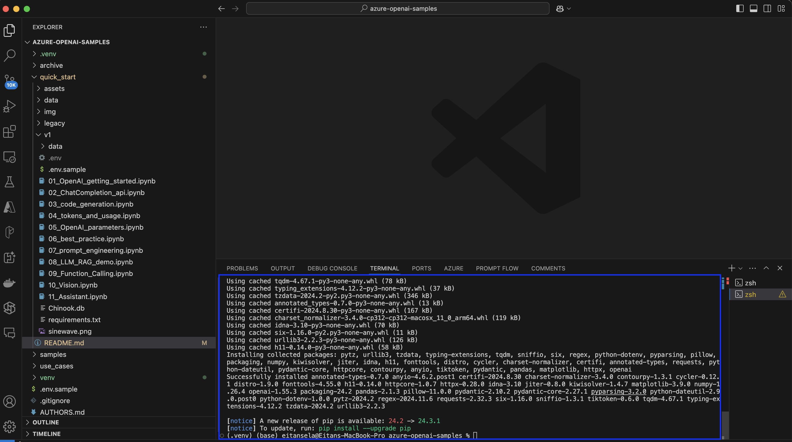

# Quickstart - Running Demos


## Demos Overview

| Name                           | Goal & Description                                                                                     | Use Cases & Topics                                                                                           |
|--------------------------------|--------------------------------------------------------------------------------------------------------|------------------------------------------------------------------------------------------------------|
| [01_OpenAI_getting_started](v1/01_OpenAI_getting_started.ipynb) | This "quick start" notebook introduces users to high-level LLM concepts like: "Summarize Text", "Classify Text", "Generate new product names", and "Embeddings". | Very good sample for beginners and to showcase in some simple examples what Azure OpenAI can do.|
| [02_Chat_Completion](v1/02_ChatCompletion_api.ipynb)        | Shows chat completion examples using Chat Completion, Analyzes Customer Feedback and Extracting PII. | Data Privacy, Information Security, Customer Data Management                               |
| [03_Code_Generation](v1/03_Code_Generation.ipynb)        | Shows how to generate code for SQL table statements. Furthermore, shows how AI can explain what code does. | Automated Query Generation, Code Assistance, Educational Tools for Developers, Code Documentation, Automated Code Review |
| [04_Tokens_And_Usage](v1/04_tokens_and_usage.ipynb)       | Demonstrates the token system. How to tokenize a prompt and get information about words.| Cost Management, Performance Optimization, Quota Management, Optimize Prompts |
| [05_OpenAI_Parameters](v1/05_OpenAI_parameters.ipynb)      | Shows what type of parameters there are and how they affect the result.| Compare Responses, Increase Diversity, Enhance Robustness, Best Practices|
| [06_Best_Practice](v1/06_best_practice.ipynb)          | Shows overall best practices. | Best Practices overall for prompt engineering with OpenAI API. |
| [07_Prompt_Engineering](v1/07_prompt_engineering.ipynb)     | Shows further best practices for optimizing prompting. | Best Practices overall for prompt engineering |
| [08_LLM_RAG](v1/08_LLM_RAG_demo.ipynb)           | Demonstrates how to do RAG using Bing Search results as provided context. | Knowledge Management, Business intelligence & analytics, Legal and compliance |
| [09_Function_Calling](v1/09_Function_Calling.ipynb)       | Shows how to integrate a custom function and have OpenAI call it to retrieve weather information. | Dynamic Calculations, Data fetching, Interactive Applications, Custom integrations  |
| [10_Vision](v1/10_Vision.ipynb)                 | Great to show what can be done with image analysis. Generates text description for provided image. | Content Creation, Accessibility, Image Classification, E-commerce |
| [11_Assistant](v1/11_Assistant.ipynb)                 | Create AI assistant for Data Visualization using advanced tools like code interpreter. | Personalized Customer Service, Employee Onboarding and Training, Sales and Marketing Support |


## Prepare Environment
- Install [Python](https://www.python.org/downloads/)
- Install [Visual Studio Code](https://code.visualstudio.com/download)
- Install [Python Extension for Visual Studio Code](https://marketplace.visualstudio.com/items?itemName=ms-python.python)
- Install [Jupyter Extension for Visual Studio Code](https://marketplace.visualstudio.com/items?itemName=ms-toolsai.jupyter)

### Install required Python packages

You can install the required Python packages in two ways:
- Manual Installation using CLI - [Link](#to-install-the-required-python-packages-manually).
- Installation using Visual Studio Code UI - [Link](#to-install-the-required-python-packages-using-visual-studio-code-ui).

#### To install the required Python packages manually:
- In Visual Studio Code -> **Terminal** -> **New Terminal**
    

- In the new **Terminal** window -> Run the following commands:
    ```
    python -m venv .venv
    source .venv/bin/activate
    pip install -r quick_start/v1/requirements.txt
    ```
- After running the commands, you should see something like this:
    

- Open `quick_start/v1/01_OpenAI_getting_started.ipynb` notebook.


#### To install the required Python packages using Visual Studio Code UI

- Open `quick_start/v1/01_OpenAI_getting_started.ipynb` notebook.
    

- Choose **Select Kernel** or **Detecting Kernels** on the upper right. Then, on the search box that opened , choose **Python Environments...**  
    

- Choose **+ Create Python Environment**  
    

- Choose **Venv** to create a new Python virtual environment  
    

- Choose the Python runtime installed on your machine
    

- Check the `quick_start/v1/requirements.txt` option to install the required `requirements.txt`, and click **OK**
    

- A status bar with Creating environment will be opened in the rightmost lower corner of Visual Studio Code, with the status and logs    
    


## Setup Environmental Variables in `.env` file in `v1` folder
After creating an Azure OpenAI service, setup the following environmental variables for 
- `AZURE_OPENAI_ENDPOINT`
- `AZURE_OPENAI_KEY`
- `AZURE_OPENAI_DEPLOYMENT_NAME`
- `EMBEDDING_MODEL_NAME` _(Required for 01_OpenAI_getting-started)_
- `BING_SUBSCRIPTION_KEY` _(Required for 08_LLM_RAG_demo)_
---
Feel free to use and copy [`.env.sample`](v1/.env.sample) and rename to `.env` inside of the `v1` folder.

## Start running the workshop

Open `quick_start/v1/01_OpenAI_getting_started.ipynb` notebook. Click the **Execute Cell** (Play button) to execute each cell. 

**Please read the markdown to learn about each section, and not just run all the cells one after the other**.


If prompted with a message to install `ipykernel` choose **install**
