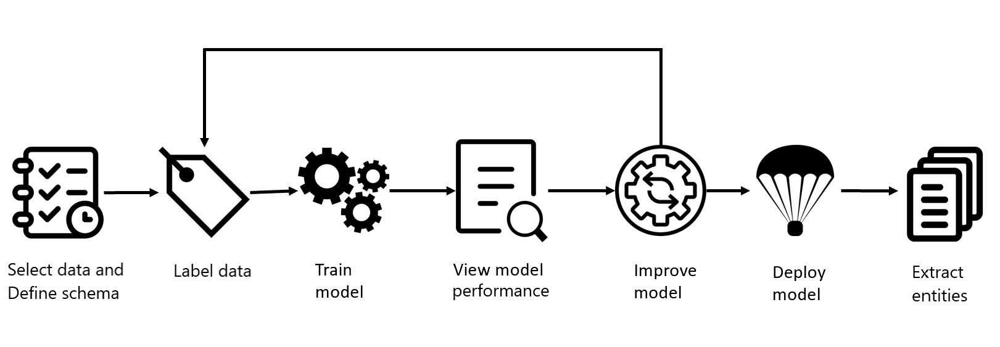
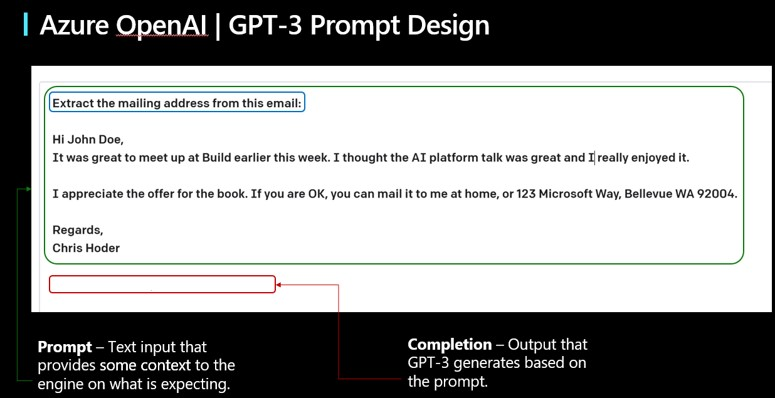

# Overview  
The ability to extract targeted pieces of information from documents, specific to each customer and use case is a common, emerging use case across industries. This typically requires iteratively training a customized model, against a curated, customer dataset. In this demo we'll show the power of OpenAI models' ability to extract precise information from a document, from a simple instruction, in natural language - enabled by the Large Language Models's (LLM) capability to understand the context of the inqury/instruction, and the context of the document.

**Steps:**  
Use-zero shot learning to:
- [ ] Provide natural language instruction task ("please extract these ~dozen pieces of information from the lease, e.g. Who is the landlord? What is the size of the property? And please return in the output in a clean json format.")
- [ ] Add the lease to the prompt
- [ ] Results!  

# Motivation  
While pretrained NER models are great for extracting general categories, persons, organizations, localations, and dates; most use cases require extraction of specific entities relevant to the customer or business. For example, if we have lease documents, while it's helpful to be able to extract all instances of a person with a generic model... it's **signifcantly** more beneficial to identify whom in the lease is specifically the landlord, and whom is the tenant. You can also, for example, extract the size of property being leased (ignoring other address found within the document) - **All without any model training or fine-tuning.** In this example, we'll investigate the plausability of extracting those, and a *~dozen* other objects of specific interest to only lease documents, simply by providing the lease, and asking the model to extract a list of **custom** entities, *without* providing any examples of what those entities should look like.  

# Task - Extracting *Custom* Entities  
Custom NER enables users to build custom AI models to extract domain-specific entities from unstructured text, such as contracts or financial documents. 
They typical training process requires developers and data scientists to iteratively label data, train, evaluate, and improve model performance before making it available for consumption. And the quality of the labeled data greatly impacts model performance[^4]. 
 

Zero shot learning, often achieves similar performance, without the iterative model training and data curation/labeling tasks!

# What is Zero-Shot Learning?  
Let's ask chatgpt to learn more about zero-shot learning!  

**Prompt (input)**  

`What is zero-shot learning and why is it powerful?`  

**Completion (output)**  

```
Zero-shot learning is a type of machine learning algorithm that allows a model to make predictions on data it has never seen before.  
This is significant because it allows the model to make predictions on data it has never seen before, which can be useful in a  
variety of applications, such as natural language processing, computer vision, and robotics. It also allows the model to generalize  
better, as it can make predictions on data it has never seen before. This is powerful because it allows the model to make  
predictions on data it has never seen before, which can be useful in a variety of applications.  
```  
</br>  

-------
In this demo, we'll submit a single prompt, including the task, in natural languge, with the lease to be analyzed, to one of the most powerful OpenAI models: text-davinci-003[^4]  
1[](./assets/zero_shot_lease_flow.jpg)

Using your OpenAI Resource [(How to get started with OpenAI)](https://learn.microsoft.com/en-us/azure/cognitive-services/openai/how-to/create-resource?pivots=web-portal), navigate to the OpenAI playground, and submit your prompt.  



# Prompt  
**Steps:**  
Use zero-shot learning to:
- [x] Provide natural language instruction task ("please extract these ~dozen pieces of information from the lease, e.g. Who is the landlord? What is the size of the property? And please return in the output in a clean json format.")
- [x] Add the lease to the prompt
- [ ] Results!  

### Natural Language Instruction Task + Prompt  
```
Using the lease below, return a json object containing:  
  
Lessor, Lessee, Property Address, Property Description, Net Size of Property, Net Size of Property Units, Gross Size of Property,  
Gross Size of Propery Units, Contract Start Date, Lease Start Date, Lease End Date, Lease Term (include the units),  
Monthly Lease Amount (include currency), Payment Frequency, Payment Address.  

Format dates as YYYY-MM-DD. 

Lease:  
```  
```LEASE AGREEMENT
Between
BOB MARSHALL
and
THE UNITED STATES OF AMERICA
ARTICLE ONE: PARTIES
I
This lease is entered into this 23th day of May, 1997, by Bob Marshall, 9 Parma Avenue, Ft.
Overview Heights, St. James, Barbados, hereinafter referred to as "the LANDLORD", and the
United States of America, acting by Frank P. Lesco, Administrative Officer of the Embassy of the
United States of America at Becktowntown, Barbados, hereinafter referred to as "the TENANT".  

ARTICLE TWO: DESCRIPTION OF PREMlSES
The LANDLORD hereby leases to the TENANT the following described Premises, together
with their appurtenances. This property comprises 3 bedrooms, 2 bathrooms, living-dining
room, family room, and kitchen, of approximately 1,725 net square feet located at #205 Lifton
Avenue, Ft. Overview Heights, St. James, Barbados, The property will be used as a diplomatic
residence in Barbados. An inventory of any mechanical and electrical equipment on the
premises, as well as condition reports of the premises, equipment, and furniture and furni shings
provided by the LANDLORD, as they now exist, signed by both parties, is attached to and made
part of this lease.  

ARTICLE THREE: LEASE TERM
The tenn of this lease shall be for six (6) years beginning June 28, 1997 and ending June 27, 2003.  

ARTICLE FOUR: LEASE RENEWAL
The lease is renewable by the TENANT under these same tenns and conditions for a further
period of 3 years, or until June 27, 2006, provided that written notice is given to the
LANDLORD at least 90 days prior to the date this Lease or any extension of it would othenvise
expIre.
In the event the TENANT exercises its right to renew, the renewal rate shall be fair market
rental, to be determined by the parties hereto. Within 90 days prior to the tennination date of the
present rental period, the LANDLORD shall give notice to the TENANT in writing of the
proposed rental amount of the renewal period. Unless the TENANT objects to the proposed rent
within twenty-one days of the receipt of such notice, the rental charge will take effect in the next
rental term.  

ARTICLE FIVE: PAYMENT
The TENANT shall pay the LANDLORD for the premises rented and for other services provided
at the following rate and terms: BDS$5,300 per month for the initial three years and BDS$5,950
for the remaining three years.
All financial obligations of the TENANT resulting from this Lease are subject to the availability
of funds appropriated annually by the Congress of the United States of America. Payments are
to be made quarterly in advance, except that the initial payment shall be for six months for the
period of June 28 through December 27, 1997 (BDS$36,200) to the LANDLORD at 11 Parma Avenue, Ft. Overview Heights, St. James, Barbados.
```  

**Steps:**  
User Zero shot learning to:
- [x] Provide natural language instruction task ("please extract these ~dozen pieces of information from the lease, e.g. Who is the landlord? What is the size of the property? And please return in the output in a clean json format.")
- [x] Add the lease to the prompt
- [x] Results!  


### Output  
```json
{
  "Lessor": "Bob Marshall",
  "Lessee": "The United States of America",
  "Property Address": "#205 Lifton Avenue, Ft. Overview Heights, St. James, Barbados",
  "Property Description": "3 bedrooms, 2 bathrooms, living-dining room, family room, and kitchen",
  "Net Size of Property": 1725,
  "Net Size of Property Units": "square feet",
  "Gross Size of Property": null,
  "Gross Size of Propery Units": null,
  "Contract Start Date": "1997-05-23",
  "Lease Start Date": "1997-06-28",
  "Lease End Date": "2003-06-27",
  "Lease Term": "6 years",
  "Monthly Lease Amount": "BDS$5,300",
  "Payment Frequency": "quarterly in advance",
  "Payment Address": "11 Parma Avenue, Ft. Overview Heights, St. James, Barbados"
}
```  

# Next Steps
* Learn about how further improvements can be attained via one-shot, few-shot learning, or fine-tuning (https://learn.microsoft.com/en-us/azure/cognitive-services/openai/how-to/fine-tuning?pivots=programming-language-studio) 
* Learn more about prompt engineering (https://learn.microsoft.com/en-us/azure/cognitive-services/openai/how-to/completions)  
* Explore more capabilities at [Azure OpenAI](https://learn.microsoft.com/en-us/azure/cognitive-services/openai/)
* Build an end-to-end doc processing pipelines with [Azure Cognitive Services](https://azure.microsoft.com/en-us/products/cognitive-services/#overview)
* OCR your documents, and take advantage of general and pretrained document models with [Azure Form Recognizer](https://azure.microsoft.com/en-us/products/form-recognizer/)
* Experiment with quickly deploying multi-service pipelines through the no-code Studio (https://github.com/Azure/business-process-automation)  


# References  
1. [SA Executed Lease Documents Dataset](https://www.gsa.gov/real-estate/real-estate-services/leasing/executed-lease-documents)  
2. [Azure Documentation](https://learn.microsoft.com/en-us/azure/cognitive-services/openai/overview)  
3. [Azure OpenAI](https://openai.com)
4. [What is Custom Named Entity Extraction](https://learn.microsoft.com/en-us/azure/cognitive-services/language-service/custom-named-entity-recognition/overview)

# Credit:  
* Kevin Tupper <kevin.tupper@microsoft.com>
* Brandon Cowen <brandoncowen@microsoft.com>  
* aka.ms/airangers
